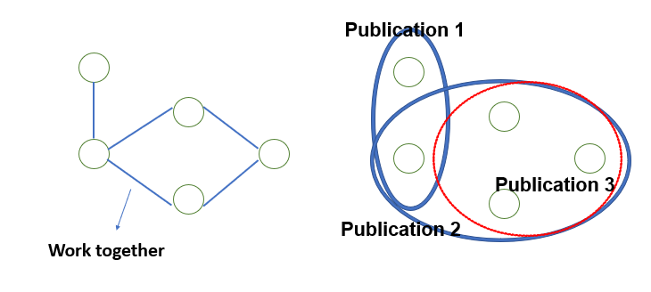

# hyper_preferentialattachment
We proposed **Preferential Attachment on hypergraph with constraint** to predict co-authorship problem. In a variety of research of co-authorship, the simple graph structure is introduced to include the relations between authors or between authors and publications and it is linked by edge connecting 2-pair nodes. However,  the relation of co-authorship has more general form which simultaneously contains several authors(more than 2-pairs) in one edge. This general information can be expressed by **hypergraph**. Also,  **Preferential Attachment(PA)** is well-known graph evolving algorithm. By suggesting the PA on hypergraph, we can design the evolution of co-authorship by general architecture   </i> 

----------

Hypergraph
-------------

